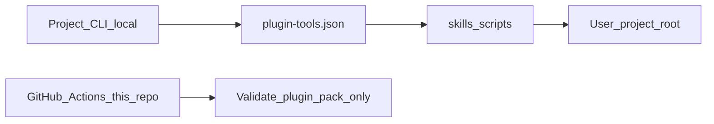

# CI/CD capabilities for external Project CLI (local)

This skill plugin pack exposes **scripts + machine-readable contracts** (`plugin-tools.json`) so a separate **Project CLI** can run quality, memory, and packaging gates on **any project root on the operator machine**.

GitHub Actions in *this* repo only prove the plugin pack itself is healthy. They are **not** a deployment pipeline for your application.

## Responsibility split

| Layer | Role |
|-------|------|
| **This plugin (skills pack)** | Scripts, JSON contracts, validators, scale gates, local release gate |
| **Project CLI (your product)** | UX, `project-root` resolution, orchestration, retries, optional deploy targets |
| **Target project (user repo)** | Source code, tests, `.codex/` artifacts, env-specific deploy config |



## Tools Project CLI should wrap first

| Tool name | Script | Typical CLI command idea |
|-----------|--------|---------------------------|
| `pack_health` | `check_pack_health.py` | `project-cli plugin health` |
| `codex_plugin_validate` | `validate_codex_plugin.py` | `project-cli plugin validate` |
| `validate_tool_contracts` | `validate_tool_contracts.py` | `project-cli plugin contracts` |
| `memory_scale_gate` | `run_scale_gate.py` | `project-cli memory scale --tier medium` |
| `memory_status` | `memory_status.py` | `project-cli memory status` |
| `local_release_gate` | `local_release_gate.py` | `project-cli release gate` |
| `trust_harness` | `trust_harness.py` | `project-cli trust check` |

Read `skills/.system/references/plugin-tools.json` for full `args_schema`, `exit_codes`, and `safety_policy`.

## What runs in GitHub (this repo only)

| Workflow | Purpose |
|----------|---------|
| `ci.yml` | Validate plugin pack + regression tests |
| `scale-nightly.yml` | Weekly large memory scale stress |
| `release.yml` | Optional manual plugin ZIP (`workflow_dispatch`) |

No `deploy.yml`. No staging/production environments for this repository.

## Local usage (today, without Project CLI)

```bash
# Gate on a user project
python skills/codex-project-memory/scripts/memory_status.py --project-root /path/to/project

# Plugin pack release check (operator machine)
python skills/.system/scripts/local_release_gate.py --format json
python skills/.system/scripts/local_release_gate.py --apply --format json
```

## Optional deploy (Project CLI / operator, not this repo's CI)

`promote_deploy.py` supports `target: none | s3 | ssh` with env vars on the **operator machine**. Wire it from Project CLI when a user explicitly opts in; do not auto-run from this plugin repo's GitHub Actions.

Schema sketch: `deploy-targets.schema.json`.
