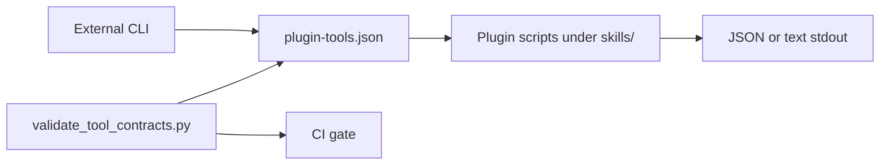

# Plugin Tool-Call Contract

This skills plugin publishes **machine-readable tool contracts** so a separate external CLI, MCP server, or IDE wrapper can discover and invoke plugin scripts safely. This repository remains a **skill/plugin pack**; it does not ship a user-facing CLI binary.

## Responsibilities

| Layer | Owns |
| --- | --- |
| **This plugin** | `plugin-tools.json`, JSON schema, `validate_tool_contracts.py`, script stdout contracts, safety boundaries, CI smoke evidence |
| **External CLI (future)** | Command UX, distribution, installer, auth prompts, token/session storage, orchestration and retries |
| **GitHub CLI (`gh`)** | PR automation auth via `gh auth login`, `GH_TOKEN`, or `GITHUB_TOKEN` in CI — never embedded in plugin JSON |

## Registry

- **Registry:** `skills/.system/references/plugin-tools.json`
- **Schema:** `skills/.system/references/plugin-tools.schema.json`
- **Validator:** `skills/.system/scripts/validate_tool_contracts.py`
- **Manifest pointers:** `skills/.system/manifest.json` → `plugin_tool_contract`

Each tool entry includes:

- `name`, `kind`, `script`, `purpose`
- `args_schema` (JSON Schema fragment for wrapper argument mapping)
- `stdout_contract`, `exit_codes`, `warning_policy`, `artifact_policy`, `safety_policy`
- Optional `smoke` block used only by the contract validator

Skill-scoped tools (full project-memory surface) remain in `codex-project-memory/references/project-memory-tools.json`.

## Wrapper consumption flow

1. Read `plugin-tools.json` and validate locally or trust CI-validated artifacts.
2. Map wrapper flags to each tool's `args_schema.required` fields.
3. Resolve `script` relative to the **skills root** (installed or source).
4. Enforce `safety_policy` before execution (network, writes, secrets).
5. Parse stdout using `stdout_contract` references.
6. Apply `warning_policy` and `exit_codes` for pass/fail semantics.



## Safety and auth policy

- **No credentials in plugin files.** Do not add tokens, PATs, or session blobs to `plugin-tools.json`, manifests, or generated `.codex/` artifacts committed to git.
- **`reads_secrets` must be `false`** for all plugin-registry tools.
- **Smoke policy:** `validate_tool_contracts.py` runs only low-cost commands (`--help`, validators, pack health, release `--dry-run`, ephemeral memory fixtures). It must not run `trust_harness --apply` or `memory_build_index` against production trees.
- **Mutating tools** (`memory_build_index`, `trust_harness` with `--apply`) require explicit user consent in the external CLI.

## Output shapes

### Validator output

Plugin validators (`validate_codex_plugin.py`, `validate_claude_plugin.py`) and `validate_tool_contracts.py` emit:

```json
{
  "status": "pass|warn|fail",
  "checks": [{"name": "...", "status": "pass|fail|warn", "detail": "..."}],
  "warnings": [],
  "failures": []
}
```

### Pack health output

`check_pack_health.py` returns the same envelope with per-check `status` values. Use `--strict` for CI gates.

### Release dry-run output

`build_release_zip.py --dry-run` reports planned archive members without writing `dist/` artifacts.

### Prompt route output

`prompt_router.py` returns JSON classification for a prompt or corpus validation results.

### Trust harness output

`trust_harness.py` returns planned or applied setup steps. Default is dry-run without `--apply`.

## Prompt routing corpus

Committed regression corpus for portable routing:

- Path: `skills/.system/references/prompt-router.corpus.json`
- CI: `python skills/.system/scripts/prompt_router.py --corpus skills/.system/references/prompt-router.corpus.json --format json`
- `trust_harness.py` loads the same file via `validate_corpus()`.

## Verification commands

```bash
python skills/.system/scripts/validate_tool_contracts.py --skills-root skills --strict --format json
python skills/.system/scripts/check_pack_health.py --skills-root skills --strict --format json
python skills/.system/scripts/prompt_router.py --corpus skills/.system/references/prompt-router.corpus.json --format json
python skills/codex-project-memory/scripts/run_scale_gate.py --tier medium --format json
python -m pytest skills/tests/test_tool_contracts.py -q
```

## Related docs

- `skills/.system/GITHUB_CLI_INTEGRATION.md` — GitHub CLI for PR automation
- `skills/codex-project-memory/references/ci-readiness.md` — project-memory CI contracts
- `skills/.system/OPERATION_RUNBOOK.md` — operational entry points
