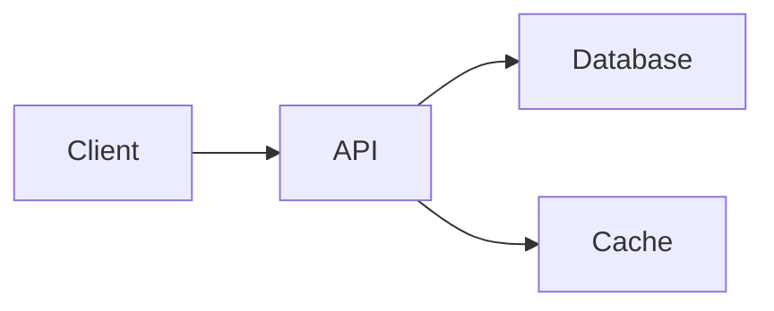

# Content Writing Patterns

Use this reference when writing long-form content: blog posts, tutorials, documentation, README files, feature announcements, or any content meant to be read, understood, and acted on.

## Content Type Decision

| Content Goal | Format | Key Pattern |
|---|---|---|
| Teach how to do something | Tutorial | Step-by-step with code + result |
| Explain a concept | Explainer | Analogy → definition → example → anti-pattern |
| Document a feature | Feature Doc | What → Why → How → Limitations |
| Announce a change | Changelog/Release | What changed → Why → Migration steps |
| Convince stakeholders | Case Study | Problem → Approach → Result → Metrics |
| Onboard new developers | README/Guide | Quick start → Architecture → Contributing |

## The PREP Framework (For Every Section)

Every content section should follow PREP:

1. **P**oint — State the main idea first
2. **R**eason — Explain why it matters
3. **E**xample — Show a concrete instance (code, screenshot, data)
4. **P**oint — Restate or connect to next section

**Bad:**
> There are many ways to handle authentication. OAuth is one option. JWT is another. Sessions are also possible. Each has pros and cons...

**Good:**
> Use JWT for stateless APIs and session cookies for server-rendered apps. JWT scales horizontally because tokens carry their own state — no shared session store needed. For example:
> ```js
> const token = jwt.sign({ userId: user.id }, SECRET, { expiresIn: '1h' });
> ```
> If your API serves mobile apps, JWT is the default choice.

## Heading Hierarchy Rules

```markdown
# Document Title (only one per document)

## Major Section (answer a reader question)

### Subsection (group related details)

#### Detail (rarely needed — consider bullets instead)
```

**Rules:**
- Never skip levels (no `#` → `###`)
- Each `##` should be scannable as a standalone answer
- Use question-style headings when helpful: `## How does authentication work?`
- Limit to 3 levels in most documents; 4 levels only for reference docs

## Writing Quality Patterns

### The "So What?" Test

After every paragraph, ask "So what?" If the reader can't answer, the paragraph is missing its point.

| Statement | So What? | Fixed |
|---|---|---|
| "We use PostgreSQL." | Why should the reader care? | "We use PostgreSQL for its JSONB support, which lets us store flexible metadata without schema migrations." |
| "The system has 3 microservices." | What does that mean for me? | "The system has 3 microservices, each deployable independently — a frontend change won't require backend redeployment." |

### Active Voice Over Passive

| Passive (weak) | Active (strong) |
|---|---|
| "The data is processed by the service." | "The service processes the data." |
| "An error was encountered." | "The parser encountered a syntax error on line 42." |
| "It was decided that..." | "The team decided to..." |

### Concrete Over Abstract

| Abstract (vague) | Concrete (useful) |
|---|---|
| "Improve performance" | "Reduce API response time from 800ms to 200ms" |
| "Handle errors properly" | "Return HTTP 422 with field-level error messages" |
| "Use best practices" | "Use parameterized queries to prevent SQL injection" |
| "Ensure quality" | "Maintain 80% test coverage with zero critical bugs" |

### Vietnamese Content Patterns

For Vietnamese documents, use these patterns:

| English Pattern | Vietnamese Equivalent | Example |
|---|---|---|
| "In this section..." | "Phần này trình bày..." | Phần này trình bày cách thiết lập môi trường phát triển. |
| "As shown in..." | "Như minh họa ở..." | Như minh họa ở Hình 3, hệ thống gồm 3 thành phần chính. |
| "The following table..." | "Bảng dưới đây..." | Bảng dưới đây so sánh các phương án triển khai. |
| "For example" | "Ví dụ" | Ví dụ, khi người dùng đăng nhập lần đầu... |
| "Note that" | "Lưu ý rằng" | Lưu ý rằng API key cần được bảo mật. |
| "In conclusion" | "Tóm lại" | Tóm lại, giải pháp đề xuất đáp ứng được 4/5 yêu cầu. |

**Vietnamese figure/table captions:**
```markdown
**Hình 1.** Sơ đồ kiến trúc hệ thống
**Bảng 2.** So sánh hiệu suất các phương án
**Biểu đồ 3.** Tỷ lệ sử dụng tính năng theo tháng
```

## Transition Phrases

Connect sections with purpose, not filler:

| Purpose | English | Vietnamese |
|---|---|---|
| Sequence | "After X, the system..." | "Sau khi X, hệ thống..." |
| Contrast | "However, in production..." | "Tuy nhiên, trong môi trường production..." |
| Cause | "Because the cache expires..." | "Do cache hết hạn..." |
| Result | "This reduces latency by 40%." | "Điều này giảm độ trễ 40%." |
| Addition | "Additionally, the API supports..." | "Ngoài ra, API còn hỗ trợ..." |
| Summary | "To summarize the approach..." | "Tóm tắt phương pháp..." |

## Anti-Patterns

### Wall of Text
**Problem:** No structure, no headings, no visual breaks.
**Fix:** Add heading every 3-5 paragraphs. Use bullets for lists of 3+ items. Use tables for comparisons.

### Burying the Lead
**Problem:** Important information at the end.
**Fix:** Start with the conclusion/recommendation. Details come after.

### Empty Calories
**Problem:** Words that add length but not meaning.
- "It is important to note that..." → Delete.
- "In order to..." → "To..."
- "At this point in time..." → "Now..."
- "Due to the fact that..." → "Because..."
- "In the event that..." → "If..."

### Citation Without Insight
**Problem:** "According to the official documentation, X is Y."
**Fix:** "X is Y (docs: link). In our case, this means we should configure Z."

## README Template

```markdown
# Project Name

> One-sentence description of what this project does.

## Quick Start

```bash
git clone <repo>
cd <project>
npm install
cp .env.example .env
npm run dev
```

## Architecture



## Features

- ✅ Feature A — <brief description>
- ✅ Feature B — <brief description>
- 🔄 Feature C — <in progress>

## API Reference

| Method | Endpoint | Description |
|---|---|---|
| GET | `/api/users` | List all users |
| POST | `/api/users` | Create user |

## Environment Variables

| Variable | Required | Description |
|---|---|---|
| `DATABASE_URL` | Yes | PostgreSQL connection string |
| `JWT_SECRET` | Yes | Token signing secret |

## Contributing

1. Fork the repository
2. Create feature branch: `git checkout -b feature/name`
3. Commit changes: `git commit -m "feat: description"`
4. Push: `git push origin feature/name`
5. Open Pull Request

## License

MIT
```
