# Diagram & Visual Documentation Patterns

Use this reference when the document needs visual explanation. Choose the simplest diagram type that communicates the point. Never add diagrams for decoration — every diagram must answer a specific question the reader has.

## Diagram Selection Decision Table

| Reader Question | Best Diagram | Tool |
|---|---|---|
| "How does data flow through the system?" | Flowchart | Mermaid `flowchart` |
| "What's the sequence of API calls?" | Sequence Diagram | Mermaid `sequenceDiagram` |
| "How are entities related?" | Entity Relationship | Mermaid `erDiagram` |
| "What are the states and transitions?" | State Diagram | Mermaid `stateDiagram-v2` |
| "Who does what and when?" | Gantt Chart | Mermaid `gantt` |
| "What's the class hierarchy?" | Class Diagram | Mermaid `classDiagram` |
| "What's the deployment topology?" | Architecture Diagram | Mermaid `C4Context` or `flowchart` |
| "How does the user journey work?" | User Journey | Mermaid `journey` |
| "What percentage/proportion?" | Pie Chart | Mermaid `pie` |
| "How does the Git branch work?" | Git Graph | Mermaid `gitGraph` |
| "What are the time relationships?" | Timeline | Mermaid `timeline` |
| "What's the mental model?" | Mind Map | Mermaid `mindmap` |
| "How is the project structured?" | Directory Tree | ASCII tree (text) |

## Mermaid Syntax Reference

### Flowchart (System Flow / Process)

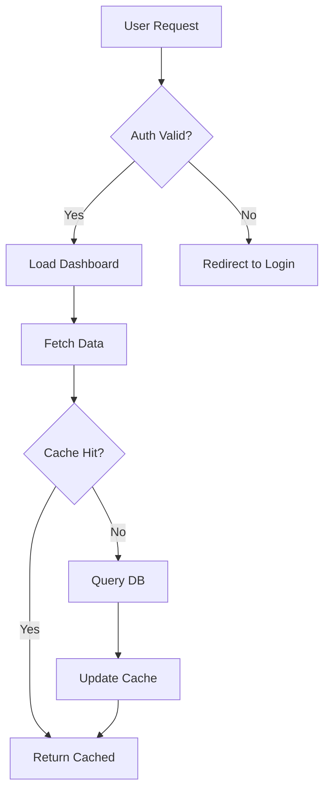

**Rules:**
- Use `TD` (top-down) for processes, `LR` (left-right) for pipelines
- Limit to 15 nodes max — split into sub-diagrams if larger
- Use `{}` for decisions, `[]` for actions, `()` for rounded, `[()]` for database
- Label edges with `|condition|` for clarity

### Sequence Diagram (API / Interaction Flow)

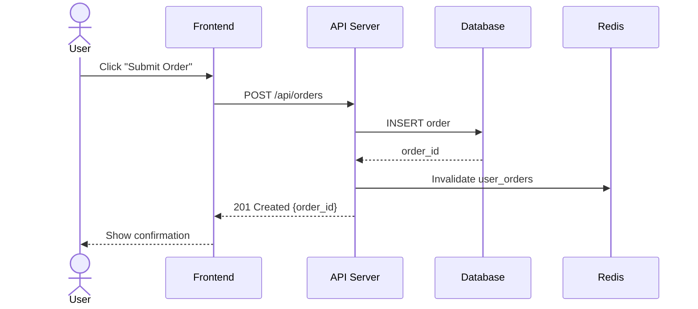

**Rules:**
- Use `actor` for humans, `participant` for systems
- Use `->>` for requests, `-->>` for responses
- Add `Note over` for important context
- Name participants with short aliases: `participant API as API Server`
- Show error paths with `alt/else` blocks:

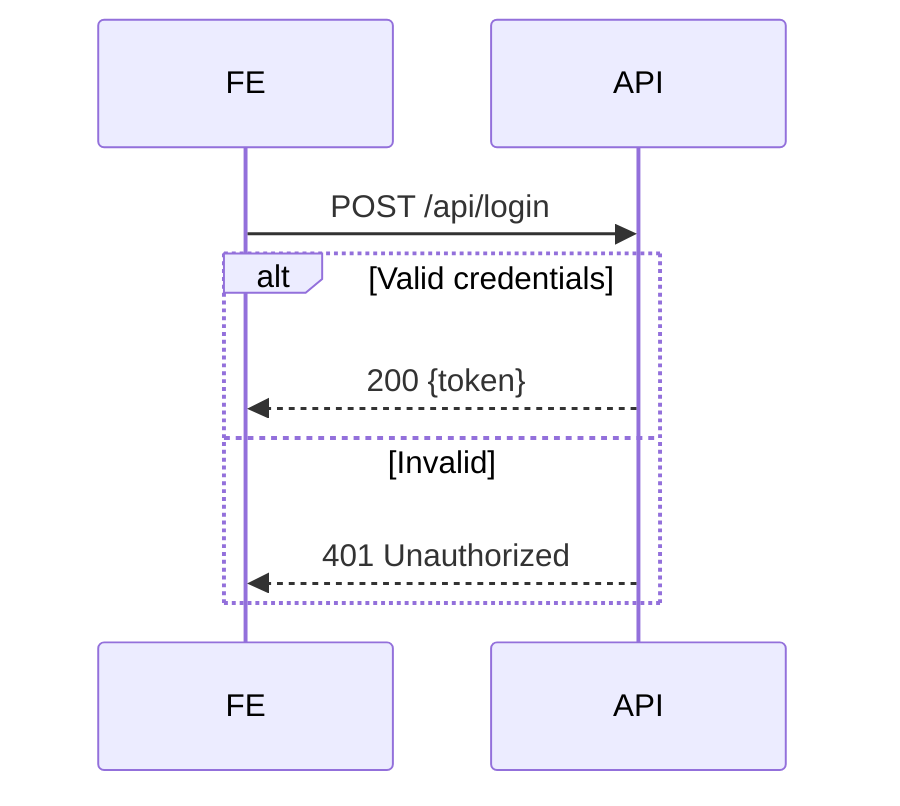

### Entity Relationship Diagram

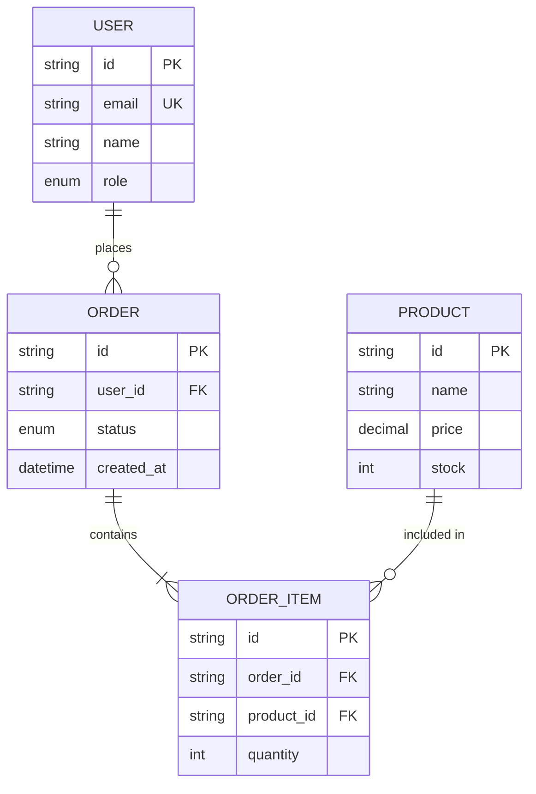

**Rules:**
- `||--||` one-to-one, `||--o{` one-to-many, `}o--o{` many-to-many
- Always mark PK, FK, UK
- Include only fields relevant to the discussion

### State Diagram

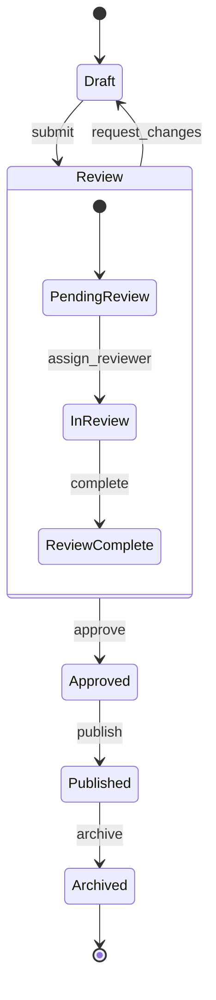

### Gantt Chart (Timeline / Sprint Plan)

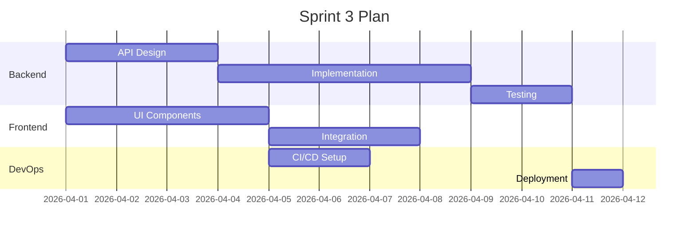

### Architecture Diagram (C4-style)

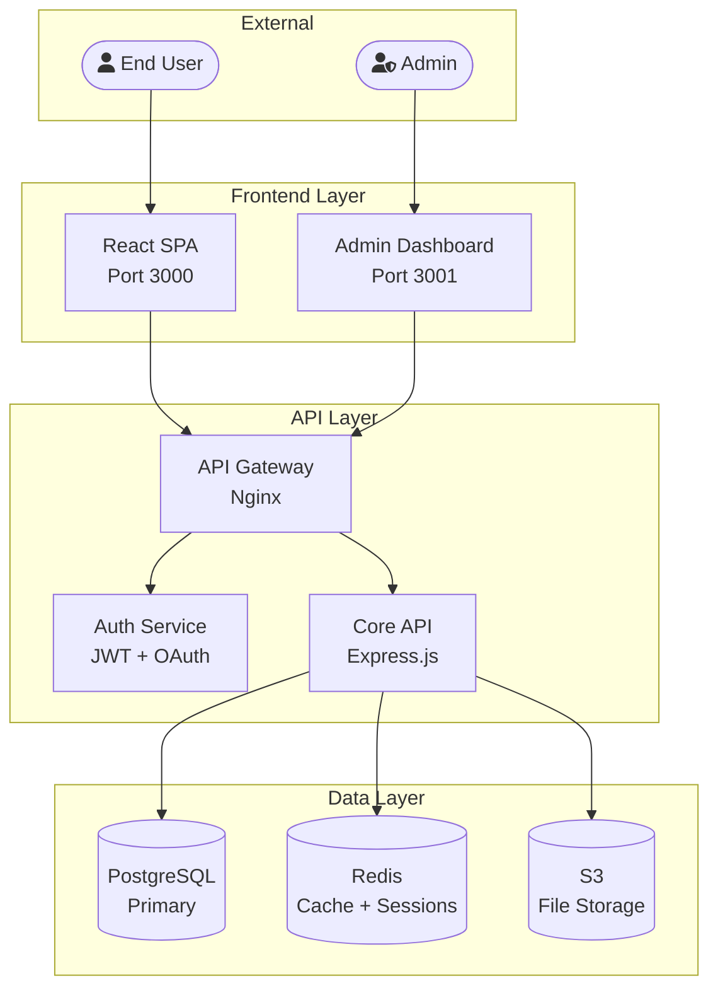

### User Journey

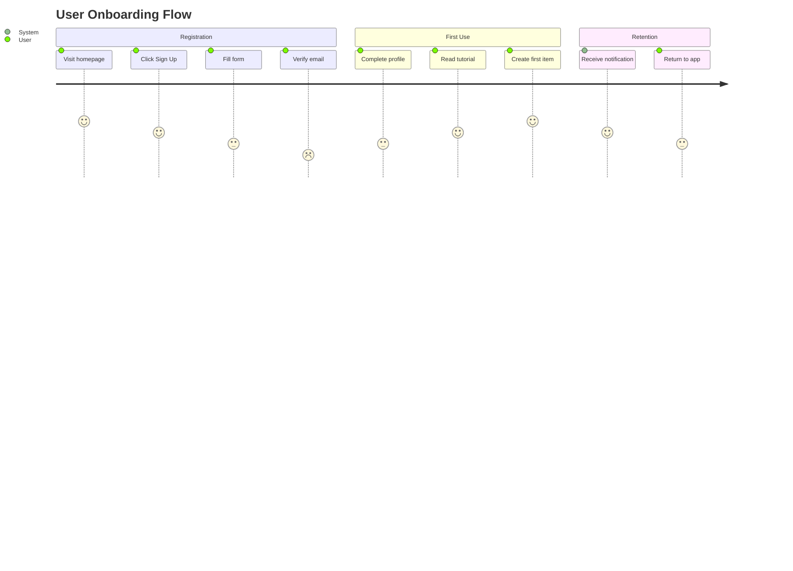

### Mind Map

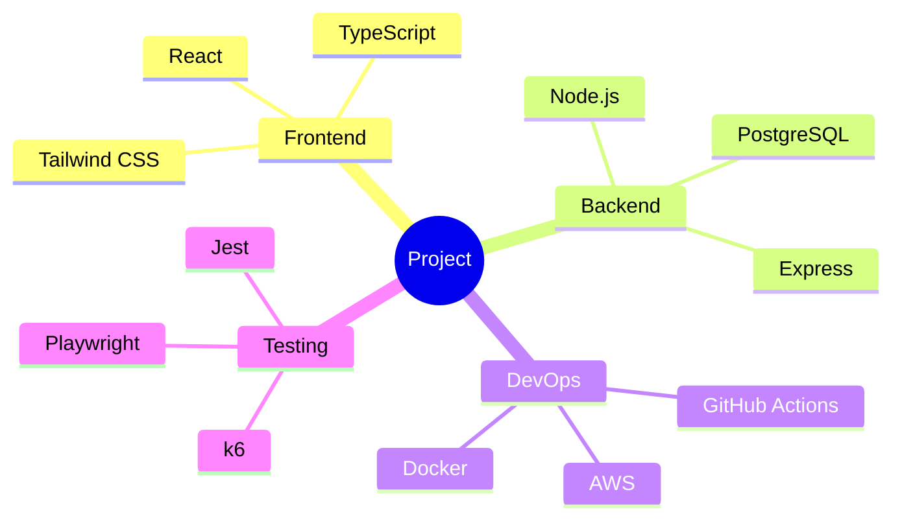

### Pie Chart

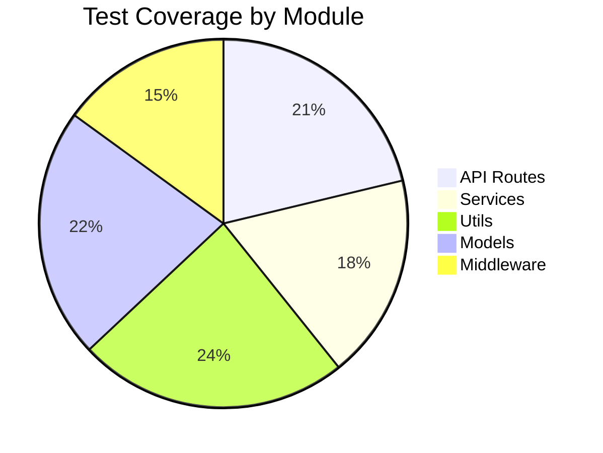

### Git Graph

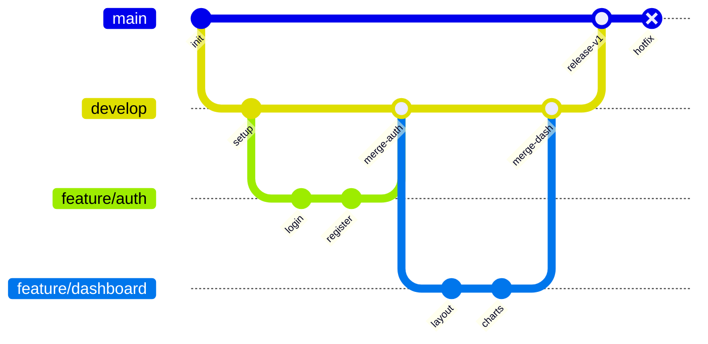

### Timeline

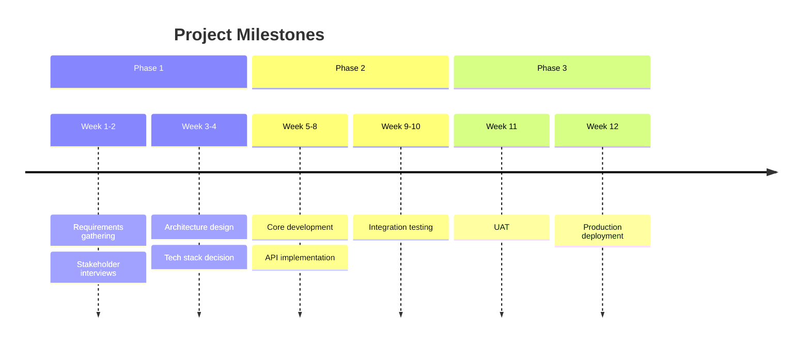

## ASCII Diagrams (For Terminal / Plain Text)

When Mermaid is not available (email, terminal, plain .txt):

### Directory Tree
```
project/
├── src/
│   ├── controllers/
│   │   ├── auth.controller.js
│   │   └── user.controller.js
│   ├── models/
│   │   └── user.model.js
│   ├── routes/
│   │   └── index.js
│   └── app.js
├── tests/
│   └── auth.test.js
├── .env.example
├── package.json
└── README.md
```

### Simple Flow
```
[Request] → [Auth Middleware] → [Controller] → [Service] → [Database]
                  ↓ (401)
             [Error Handler]
```

### Comparison Table
```
┌──────────────┬───────────┬───────────┬──────────┐
│ Feature      │ Option A  │ Option B  │ Option C │
├──────────────┼───────────┼───────────┼──────────┤
│ Cost         │ $$$       │ $$        │ $        │
│ Performance  │ ★★★★★     │ ★★★★      │ ★★★      │
│ Complexity   │ High      │ Medium    │ Low      │
└──────────────┴───────────┴───────────┴──────────┘
```

## Diagram Quality Rules

1. **One diagram = one question answered.** If you need to show both data flow and entity relationships, use two diagrams.
2. **Label everything.** Every edge, every node. The reader should never have to guess what an arrow means.
3. **Max complexity:** 15 nodes per diagram. Split into layers if larger.
4. **Caption required.** Every diagram must have a title or a sentence before it explaining what the reader should learn from it.
5. **Consistent notation.** Use the same shapes for the same concepts across all diagrams in one document.
6. **Color with purpose.** Use colors to highlight status (green=ok, red=error, yellow=warning), not for decoration.
7. **Test render.** Always verify Mermaid renders correctly before delivering — syntax errors are common.

## When NOT to Use a Diagram

- The relationship can be stated in one sentence → use text
- The data is better as a table → use a table
- The reader will only read it once → keep it textual
- The document is being copy-pasted into email → use ASCII
