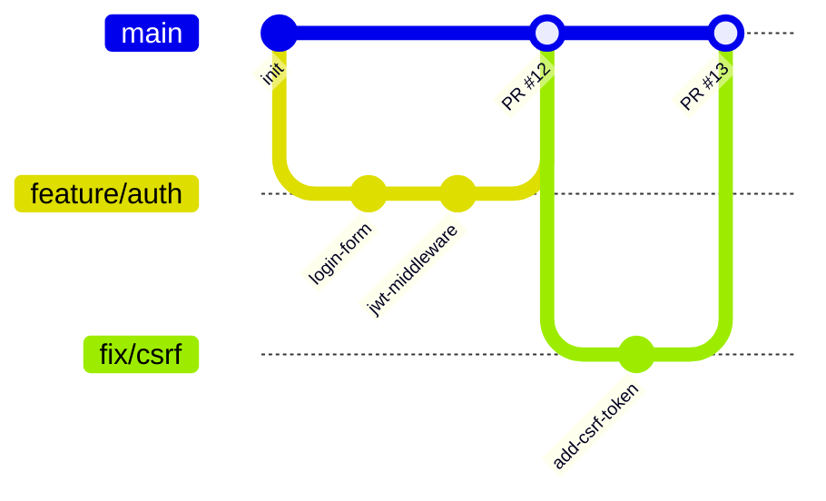

# Git Workflow Patterns

Standard Git workflows for team collaboration, branching strategies, commit conventions, and PR processes.

## Branching Strategies

### GitHub Flow (Recommended for Most Projects)

Simple, CI/CD-friendly. Best for continuous deployment.

```
main ─────────────────────────────────────────────►
  ├── feature/user-auth ──── PR ──── merge ──┤
  ├── feature/dashboard ─────────── PR ──── merge ──┤
  └── fix/login-redirect ── PR ── merge ──┤
```



**Rules:**
- `main` is always deployable
- Create feature branch from `main`
- Open PR when ready for review
- Merge via squash-merge or merge commit
- Delete branch after merge

### Git Flow (For Release-Based Projects)

Best for projects with scheduled releases, versioned APIs, or mobile apps.

```
main ──────────────────────── tag v1.0 ──── tag v2.0 ──►
  │                              ▲              ▲
develop ──────────────────── merge ───────── merge ──►
  ├── feature/x ── merge ──┤
  ├── feature/y ────────── merge ──┤
  │                    ├── release/1.0 ── bugfix ── merge ──┤
  └── hotfix/critical ──────────────── merge to main+develop
```

**Branches:**
- `main` — production releases only, tagged
- `develop` — integration branch, always ahead of main
- `feature/*` — from develop, merge back to develop
- `release/*` — from develop, bugfix only, merge to main+develop
- `hotfix/*` — from main, merge to main+develop

### Trunk-Based (For Experienced Teams)

Best for: teams with strong CI, feature flags, and fast review cycles.

```
main ──── commit ──── commit ──── commit ──── commit ──►
  └── short-lived-branch (max 1-2 days) ── merge ──┤
```

**Rules:**
- Commit directly to `main` or very short-lived branches (<2 days)
- Use feature flags to hide incomplete work
- Requires strong CI and automated testing

## Commit Conventions

### Conventional Commits

```
<type>(<scope>): <description>

[optional body]

[optional footer(s)]
```

| Type | When to Use |
|---|---|
| `feat` | New feature |
| `fix` | Bug fix |
| `docs` | Documentation only |
| `style` | Formatting, no code change |
| `refactor` | Code change that neither fixes nor adds |
| `perf` | Performance improvement |
| `test` | Adding/fixing tests |
| `chore` | Build process, tooling, dependencies |
| `ci` | CI/CD configuration |
| `revert` | Reverting a previous commit |

**Examples:**
```bash
feat(auth): add JWT refresh token rotation
fix(api): handle null user in GET /users/:id
docs(readme): add deployment instructions
refactor(services): extract email logic into EmailService
test(orders): add integration tests for checkout flow
chore(deps): upgrade express from 4.18 to 4.19
ci(github): add PostgreSQL service to test workflow
```

**Breaking changes:**
```bash
feat(api)!: change /users response format to paginated

BREAKING CHANGE: GET /users now returns { data: [], meta: { total, page } }
instead of a plain array. Update all clients.
```

### Commit Message Rules

1. Imperative mood: "add feature" not "added feature"
2. No period at end of subject line
3. Subject line ≤ 72 characters
4. Body wraps at 72 characters
5. Explain WHAT and WHY, not HOW (code shows how)
6. Reference issues: `fix(auth): prevent session fixation (closes #42)`

## PR / Merge Request Template

```markdown
## What
<One sentence describing the change.>

## Why
<Business reason or issue reference.>

## How
<Brief technical approach — what files changed and why.>

## Testing
- [ ] Unit tests added/updated
- [ ] Integration tests pass
- [ ] Manual testing done (describe scenario)
- [ ] Edge cases considered

## Screenshots
<If UI change — before/after screenshots.>

## Checklist
- [ ] Code follows project conventions
- [ ] No console.log or debug code left
- [ ] Documentation updated if needed
- [ ] No new lint warnings
- [ ] Migrations are reversible

## Related Issues
Closes #<issue>
```

## Git Hooks (Automation)

### Pre-Commit (Via Husky + lint-staged)

```json
// package.json
{
  "lint-staged": {
    "*.{js,ts,tsx}": ["eslint --fix", "prettier --write"],
    "*.{css,md,json}": ["prettier --write"]
  }
}
```

```bash
# Setup
npx husky init
echo "npx lint-staged" > .husky/pre-commit
```

### Commit Message Validation (Via Commitlint)

```bash
npm install -D @commitlint/cli @commitlint/config-conventional
echo "module.exports = { extends: ['@commitlint/config-conventional'] }" > commitlint.config.js
echo "npx --no -- commitlint --edit \$1" > .husky/commit-msg
```

## Merge Strategies

| Strategy | When to Use | Command |
|---|---|---|
| Merge commit | Preserve full branch history | `git merge --no-ff feature` |
| Squash merge | Clean history, many small commits | `git merge --squash feature` |
| Rebase + FF | Linear history, clean log | `git rebase main && git merge --ff-only` |

**Recommendation:** Use squash merge for feature branches (clean history) and merge commits for release branches (preserve context).

## Conflict Resolution

```bash
# 1. Update your branch with latest main
git fetch origin
git rebase origin/main

# 2. If conflicts appear
# Edit conflicted files — look for <<<<<<< markers
# Choose the correct version

# 3. Mark resolved and continue
git add <resolved-files>
git rebase --continue

# 4. If rebase goes wrong
git rebase --abort   # safely returns to pre-rebase state
```

## Tag & Release

```bash
# Create annotated tag for releases
git tag -a v1.2.0 -m "Release 1.2.0: add dashboard and fix auth bug"
git push origin v1.2.0

# List tags
git tag -l "v1.*"

# Create release from tag (GitHub CLI)
gh release create v1.2.0 --title "v1.2.0" --notes-file CHANGELOG.md
```
