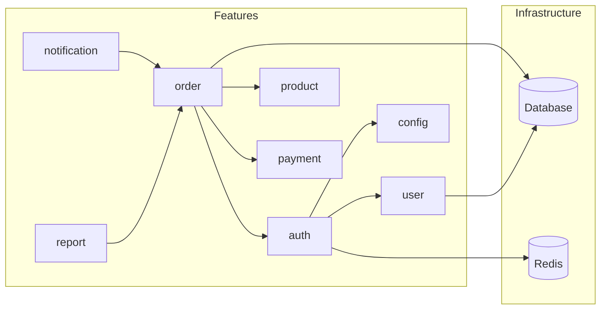

# Knowledge Graph Spec

## Purpose

Build a project-wide structural graph (dependencies, module boundaries, routes, models) so AI can reason with architecture-level context instead of guessing from file names.

## When To Build

- At project start.
- After major restructuring (new modules, moved files, architecture changes).
- Weekly refresh for active repositories.
- Before cross-module refactors or large feature additions.

## Output Schema

```json
{
  "project": "my-project",
  "generated_at": "2026-04-25T14:00:00Z",
  "total_nodes": 87,
  "total_edges": 134,

  "modules": [
    {
      "name": "auth",
      "path": "src/features/auth/",
      "files": 8,
      "exports": ["AuthController", "AuthService", "JwtGuard", "AuthModule"],
      "depends_on": ["user", "config"],
      "depended_by": ["order", "admin"]
    },
    {
      "name": "order",
      "path": "src/features/order/",
      "files": 12,
      "exports": ["OrderController", "OrderService", "OrderModule"],
      "depends_on": ["auth", "product", "payment"],
      "depended_by": ["report", "notification"]
    }
  ],

  "routes": [
    {
      "method": "POST",
      "path": "/api/auth/login",
      "handler": "src/features/auth/auth.controller.ts:login",
      "middleware": ["rateLimiter", "validateBody"],
      "auth_required": false
    },
    {
      "method": "GET",
      "path": "/api/orders",
      "handler": "src/features/order/order.controller.ts:list",
      "middleware": ["jwtGuard", "paginationParser"],
      "auth_required": true
    }
  ],

  "models": [
    {
      "name": "User",
      "source": "prisma/schema.prisma",
      "fields": ["id", "email", "name", "password", "role", "createdAt"],
      "relations": [
        { "to": "Order", "type": "one-to-many" },
        { "to": "Session", "type": "one-to-many" }
      ]
    },
    {
      "name": "Order",
      "source": "prisma/schema.prisma",
      "fields": ["id", "userId", "status", "total", "createdAt"],
      "relations": [
        { "to": "User", "type": "many-to-one" },
        { "to": "OrderItem", "type": "one-to-many" }
      ]
    }
  ],

  "dependency_tree": {
    "external": {
      "express": "4.19.2",
      "prisma": "5.14.0",
      "jsonwebtoken": "9.0.2",
      "zod": "3.23.4"
    },
    "circular_dependencies": [],
    "orphaned_modules": ["src/utils/legacy-helpers.ts"]
  }
}
```

## Graph Visualization

The knowledge graph can be rendered as a Mermaid diagram for documentation:



## How AI Uses It

1. Run `build_knowledge_graph.py` to generate `.codex/knowledge-graph.json`.
2. Read graph before complex refactors, cross-module changes, or API-impact work.
3. Use module boundaries and route/model maps to reduce incorrect assumptions.
4. When modifying a module, check `depended_by` to identify downstream impact.
5. When adding a new feature, check existing modules to avoid duplication.

## Detection Rules

| Node Type | Detection Method |
|---|---|
| Modules | Directory structure + barrel exports (index.ts) |
| Routes | Express/Next.js route declarations |
| Models | Prisma schema, TypeORM entities, Mongoose schemas |
| Dependencies | `package.json` + import analysis |
| Circular deps | DFS cycle detection on import graph |
| Middleware | Express `app.use()` and route-level middleware |

## Complements

- `predict_impact.py` can use graph context to estimate dependents more accurately.
- `project-profile.json` and session summaries provide additional style/history context.
- `codex-docs-change-sync` uses module boundaries to map code changes to documentation.

## Limitations

- Parsing is regex-based and best-effort.
- Dynamic imports, runtime DI containers, and advanced runtime wiring may be missed.
- Re-run regularly to keep graph fresh.
- Does not analyze runtime behavior — only static structure.
