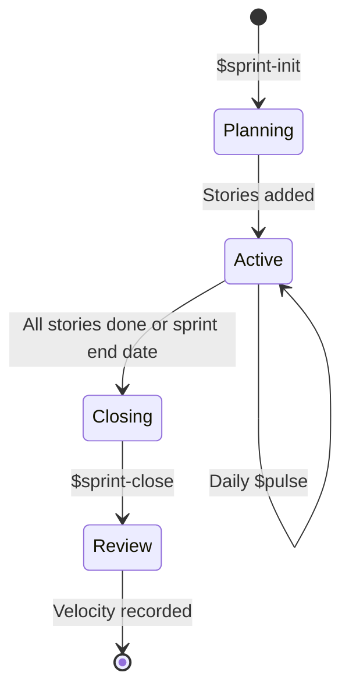

## TL;DR
Project dashboard brain. Maintains persistent state in `.codex/pulse/` — sprint, priorities, blockers, risks, milestones. When user asks "hôm nay thế nào?" or "$today", read all state files, run quality check, and generate a comprehensive daily brief. This is the skill that makes the agent know WHERE the project is and WHAT to do next.

## Activation

1. Activate on `$pulse`, `$today`, `$daily`, `$status`, `$brief`.
2. Activate on "hôm nay thế nào?", "status update", "what's next?", "what should I work on?", "project status", "daily standup", "morning brief".
3. Activate on `$sprint-init`, `$done`, `$block`, `$unblock`, `$milestone`, `$priority`, `$risk`.
4. Activate on "bắt đầu sprint", "hoàn thành story", "bị block", "deadline", "rủi ro".
5. Auto-load with `codex-workflow-autopilot` when routing daily check-ins.
6. Auto-load with `codex-scrum-subagents` during sprint ceremonies.
7. Auto-suggest on session start if `.codex/pulse/sprint-state.json` exists.

**Announce at start:** "Loading project pulse — checking sprint state, priorities, and blockers."

## State Files

All project state lives in `.codex/pulse/` at the project root:

```
.codex/pulse/
├── sprint-state.json       # Current sprint: goal, stories, status, dates
├── priority-queue.json     # Ordered list of what to do next
├── blockers.json           # Active blockers with owners and age
├── risk-register.json      # Risks with severity, probability, mitigation
├── milestones.json         # Deadlines and milestone tracking
└── daily-brief.md          # Latest generated morning brief
```

## Command Reference

### Daily Operations

| Command | Action | Example |
|---|---|---|
| `$today` / `$pulse` | Generate daily brief | "Hôm nay thế nào?" |
| `$priority` | Show priority queue | "Việc gì cần làm trước?" |
| `$priority reorder` | Reorder priorities | "Đổi thứ tự ưu tiên" |

### Sprint Management

| Command | Action | Example |
|---|---|---|
| `$sprint-init` | Initialize new sprint | "$sprint-init Sprint 4 --goal 'Complete payment flow' --end 2026-05-10" |
| `$sprint-close` | Close current sprint, calculate velocity | "$sprint-close" |
| `$add-story` | Add story to sprint backlog | "$add-story PAY-001 'Stripe checkout' --points 5 --owner @dev-a" |
| `$done <id>` | Mark story complete | "$done PAY-001" |
| `$wip <id>` | Mark story in-progress | "$wip PAY-002" |

### Blocker Management

| Command | Action | Example |
|---|---|---|
| `$block <id> <reason>` | Add blocker | "$block PAY-001 'Waiting for Stripe API key'" |
| `$unblock <id>` | Remove blocker | "$unblock PAY-001" |
| `$blockers` | List all active blockers | "$blockers" |

### Risk & Milestone Management

| Command | Action | Example |
|---|---|---|
| `$risk <desc>` | Add risk | "$risk 'Payment integration delay' --severity high" |
| `$risk resolve <id>` | Close a risk | "$risk resolve RISK-003" |
| `$milestone <name> <date>` | Add milestone | "$milestone 'Demo day' 2026-05-15" |
| `$milestones` | Show all milestones with proximity | "$milestones" |

## Daily Brief Protocol

When `$today` or `$pulse` is triggered:

### Step 1: Read State

```
1. Read .codex/pulse/sprint-state.json → sprint progress
2. Read .codex/pulse/priority-queue.json → what's next
3. Read .codex/pulse/blockers.json → what's stuck
4. Read .codex/pulse/risk-register.json → active risks
5. Read .codex/pulse/milestones.json → upcoming deadlines
```

### Step 2: Gather Signals

```
6. Check git log --since=yesterday → recent commits
7. Run quality check if project has test/lint commands
8. Read latest .codex/sessions/ summary → yesterday's context
9. Count open TODOs/FIXMEs if available
```

### Step 3: Generate Brief

```
10. Calculate sprint progress (stories done / total, time elapsed / total)
11. Identify overdue milestones
12. Identify stale blockers (> 2 days old)
13. Generate priority recommendations
14. Write .codex/pulse/daily-brief.md
15. Present to user
```

### Step 4: Recommend Action

```
16. If blockers exist → recommend unblocking action first
17. If deadline < 3 days → flag urgency
18. If quality degrading → recommend quality fix before features
19. Otherwise → recommend top priority from queue
```

## Daily Brief Output Format

```markdown
# 📊 Daily Brief — [Date]

## Sprint [N]: [Goal]
**Progress:** [X/Y stories] ([Z]%) | **Time:** Day [D/T] ([P]%)
**Velocity risk:** [On track / Behind / Ahead]

[Progress bar visualization]

## 🔴 Blockers ([count])
| Story | Blocker | Age | Owner | Action Needed |
|---|---|---|---|---|
| [id] | [reason] | [days] | [who] | [next step] |

## ⚠️ Risks ([count active])
| Risk | Severity | Probability | Mitigation |
|---|---|---|---|
| [desc] | 🔴/🟡/🟢 | H/M/L | [action] |

## ⏰ Upcoming Deadlines
| Milestone | Date | Days Left | Status |
|---|---|---|---|
| [name] | [date] | [N days] | 🟢/🟡/🔴 |

## 📈 Quality Pulse
| Signal | Status | Trend |
|---|---|---|
| Tests | [pass rate] | [↑/↓/→] |
| Lint | [error count] | [↑/↓/→] |
| Tech debt | [signal count] | [↑/↓/→] |
| Security | [finding count] | [↑/↓/→] |

## 📋 Today's Priorities
1. 🔴 [Urgent: unblock/fix] — [reason]
2. 🟡 [High: continue/start] — [story or task]
3. 🟢 [Normal: next in queue] — [story or task]

## 💡 Yesterday's Progress
[Summary from latest session or git log]
```

## Sprint State Management

### Sprint Lifecycle



### Velocity Tracking

After each sprint close, record:

```json
{
  "sprint": "Sprint 3",
  "planned_points": 21,
  "delivered_points": 18,
  "velocity": 18,
  "stories_planned": 7,
  "stories_completed": 6,
  "carryover": ["PAY-003"]
}
```

Use velocity history to forecast future sprint capacity:
- `recommended_commitment = average(last 3 sprints velocity) × 0.85`

## Priority Calculation Rules

When ordering the priority queue:

```
Priority Score = base_priority + urgency_bonus + blocker_penalty + deadline_bonus

base_priority:
  - critical: 100
  - high: 70
  - medium: 40
  - low: 10

urgency_bonus:
  - blocked_dependency: +30 (something else waiting on this)
  - stale_wip > 3 days: +20

blocker_penalty:
  - currently_blocked: -50 (deprioritize until unblocked)

deadline_bonus:
  - milestone < 3 days: +40
  - milestone < 7 days: +20
  - milestone < 14 days: +10
```

## State Initialization

When no `.codex/pulse/` exists, on `$sprint-init`:

1. Create `.codex/pulse/` directory
2. Ask user for:
   - Sprint name and number
   - Sprint goal (one sentence)
   - Start date and end date
   - Stories to include (or import from backlog)
3. Generate initial state files
4. Generate first daily brief

When `.codex/pulse/` already exists but sprint is closed:

1. Archive previous sprint to `.codex/pulse/archive/sprint-N/`
2. Initialize new sprint state
3. Carry over incomplete stories (if user confirms)

## Integration with Other Skills

| Skill | Integration |
|---|---|
| `codex-project-memory` | Read session summaries for "yesterday's progress"; read decisions for context |
| `codex-execution-quality-gate` | Run quality scripts for "quality pulse" section of daily brief |
| `codex-scrum-subagents` | Use ceremony workflows for sprint events; share sprint state |
| `codex-workflow-autopilot` | Route `$today` to pulse; use priority queue for "what next?" decisions |
| `codex-context-engine` | Load genome.md for project structure awareness alongside sprint state |
| `codex-verification-discipline` | Verify story completion claims with evidence before marking $done |
| `codex-document-writer` | Use report templates for sprint reports and progress updates |

## Hard Rules

- Never mark a story `done` without verification evidence (tests, build, demo).
- Never remove a blocker without confirming the blocking condition is resolved.
- Never ignore a milestone < 3 days away — always flag in daily brief.
- Always read state files before generating any brief — no guessing from memory.
- Always persist state changes to files — memory alone decays between sessions.
- Stale blockers (> 2 days) get escalation flag automatically.
- Sprint velocity is calculated from actual delivered points, not planned.
- When quality degrades (test failures, new critical debt), flag before feature work.

## Reference Files

- `references/state-schemas.md`: JSON schemas for all `.codex/pulse/` state files.
- `references/daily-brief-template.md`: daily brief format, quality rules, and examples.
- `references/priority-engine.md`: priority calculation, reordering rules, and queue management.
