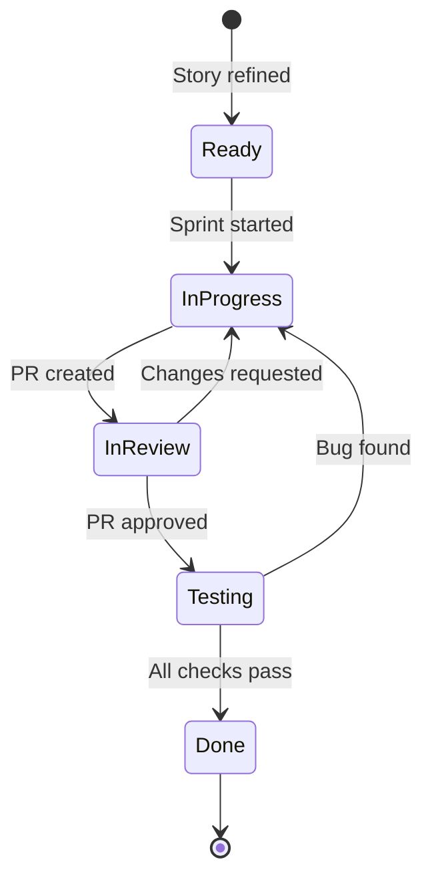

# Story Delivery

## Lead

`scrum-orchestrator` or the story's primary specialist

## Support

Impacted developers, `qa-engineer`, optional `security-engineer`, optional `devops-engineer`

## Steps

1. **Start from story packet:** Read acceptance criteria, dependencies, and risk notes.
2. **Set up workspace:** Create feature branch or worktree if complex.
3. **Implement within agreed scope:** Follow TDD — write test first, then implement.
4. **Run verification:** Execute tests, lint, type checks after each increment.
5. **Self-review:** Check diff against acceptance criteria before requesting review.
6. **Create PR:** Use PR template, link to story, attach screenshots if UI change.
7. **Address review feedback:** Fix issues, re-run tests, don't force-push without notice.
8. **Confirm done:** All criteria met, tests pass, docs updated, PR approved.
9. **Merge and clean up:** Squash merge, delete branch, update sprint board.

## Definition of Done (DoD) Checklist

Before marking a story as "Done," verify ALL of:

- [ ] All acceptance criteria from story packet are met
- [ ] Unit tests written and passing
- [ ] Integration tests passing (if applicable)
- [ ] No new lint errors or type errors
- [ ] Code reviewed and PR approved
- [ ] Documentation updated (if API, config, or user-facing change)
- [ ] No hardcoded secrets, debug logs, or TODO hacks
- [ ] Works in development environment (smoke tested)
- [ ] Sprint board card moved to "Done"
- [ ] Demo-ready (can be shown in sprint review)

## PR Template for Stories

```markdown
## Story
[Link to story or paste title]

## Changes
- [File/module: what changed and why]

## Acceptance Criteria Verification
- [x] Criterion 1 — verified by [test name or manual step]
- [x] Criterion 2 — verified by [test name or manual step]

## Testing
- [ ] Unit tests added/updated
- [ ] Integration tests pass
- [ ] Manual testing done

## Screenshots
[If UI change — before/after]

## Notes
[Any context for reviewers]
```

## Story Workflow Diagram



## Deliverables

- Implementation matching acceptance criteria
- Passing tests and verification evidence
- Approved and merged PR
- Updated documentation (if applicable)
- Done or blocked decision with evidence

## Anti-Patterns

| Anti-Pattern | Fix |
|---|---|
| Starting without reading acceptance criteria | Always read story packet first |
| Scope creep during implementation | If new work emerges, create a new story |
| Skipping self-review before PR | Review your own diff against AC first |
| Marking done without running tests | Evidence before claims (codex-verification-discipline) |
| Force-pushing after review without notice | Communicate changes to reviewers |
